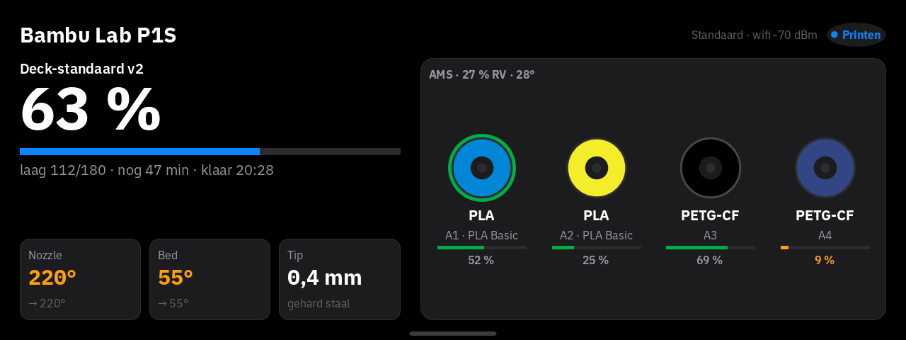

# Bambu Lab Printer for the Braiins Deck

Live status of a Bambu Lab printer on your Braiins Deck: progress, temperatures, every AMS spool,
and a camera feed — read-only, straight from your local network.



- **Progress, layer and time left**, with the estimated finish time once the print is under way.
- **Nozzle and bed temperature**, each with its target, plus the fitted nozzle's diameter and
  material (handy before loading a filament that needs the hardened-steel nozzle).
- **Every AMS spool**: colour, material, name and percent remaining, with the one in use
  highlighted. A swap to a near-empty spool shows at a glance.
- **Alerts on the light strip and a sound** when a print finishes, fails, pauses, or a spool runs
  low — tap the screen to clear them.
- **A camera picture**, refreshed while you're printing or watching, and otherwise only once in a
  while — so it doesn't needlessly load your network or the printer.
- **English or Dutch**, picked in the widget's settings.
- Built for the small ARM chip inside the Deck: no permanently-running touch areas, no endless
  animations, CPU use stays low while the widget sits in a scene.

## What you need

- A Braiins Deck whose firmware runs **widget SDK 0.6**. Check with the command below; it should
  print `widget SDK version 0.6.0`. The Deck shows its IP when you swipe down on its screen.

  ```bash
  ssh root@<deck-ip> "grep -m1 -o 'widget SDK version [0-9.]*' /var/log/bmc/run-bmc-wasm-host-sdk-v0.log"
  ```

- Root SSH login to the Deck with a key. If you can log in with a password, set that up once with
  `ssh-copy-id root@<deck-ip>`.
- A Bambu Lab printer (P1, X1 or A1 series) with **LAN Mode** on and its access code at hand
  (Settings → Network on the printer's screen, or Bambu Studio's device panel).
- A computer that's on all the time, on the same network as the printer and the Deck — the
  bridge below runs there. A Raspberry Pi, a home server, or the same machine Bambu Studio runs on
  all work; Linux with systemd is assumed for the install script, but the bridge itself is plain
  Python and runs anywhere.
- That computer needs git, [Git LFS](https://git-lfs.com), [Rust](https://rustup.rs) and
  python3 with pip. The pinned Rust version installs itself on the first build.

## Install

```bash
git lfs install
git clone --recurse-submodules https://github.com/<you>/braiins-deck-bambu-printer.git
cd braiins-deck-bambu-printer
bridge/install.sh              # the status bridge, as a user service
./deploy.sh <deck-ip>          # builds and installs the widget
```

`bridge/install.sh` stops the first time to let you fill in
`~/.config/bambu-bridge/config.json` (your printer's IP, serial and access code, and the Deck's
IP) — run it again once that's done. Then add **Bambu Lab Printer** to a scene in the Deck's web
interface, and set its **Bridge URL** to `http://<bridge-computer-ip>:9152`. The first
`./deploy.sh` takes a few minutes, as it builds the widget and the SDK's packaging tool. Both
scripts are safe to re-run, for example after a Deck firmware update removes what it installed.

## How it works

```text
                   MQTT (TLS, LAN only)                read-only JSON + JPEG
 Bambu printer ───────────────────────▶ bambu-bridge ───────────────────────▶ widget
                   camera stream                        (access code never leaves
                                                           the bridge computer)
```

- **`bridge/bambu_bridge.py`** connects to the printer over your local network only: MQTT (TLS,
  port 8883) for status and the built-in camera stream (port 6000) for pictures. The access code
  stays in the bridge's config file; the Deck never receives it, so losing the Deck (or anyone
  nearby who can reach it) never exposes control of the printer.
- It serves two read-only endpoints, reachable only from the addresses listed in its config
  (your Deck, and itself):
  - `GET /bambu.json[?lang=en|nl]` — current state, temperatures, progress, every AMS spool
  - `GET /camera.jpg` — the latest camera picture
- **No control whatsoever.** The bridge never publishes a command to the printer; it only
  subscribes to its status.
- **Optional notifications**: set `notify.url` in the config to POST a short message there (works
  with [ntfy](https://ntfy.sh), a Home Assistant webhook, or anything else that takes a POST), or
  `notify.command` to run a local command instead, when a print finishes, fails or pauses.

## Known limits

- One printer per bridge instance. Run a second copy with its own config and port for a second
  printer.
- The widget is built for widget SDK 0.6. Firmware with a newer SDK needs it ported.
- Camera pictures need the printer's camera enabled and LAN Mode on.
- If something doesn't work, check `journalctl --user -u bambu-bridge -f` on the bridge computer,
  and confirm `curl http://<bridge-ip>:9152/bambu.json` answers from a browser or terminal on your
  network.

## Uninstall

```bash
./undeploy.sh <deck-ip>
systemctl --user disable --now bambu-bridge.service   # on the bridge computer
rm -rf ~/.local/share/bambu-bridge ~/.config/bambu-bridge
```

## What's on the Deck

| Path                              | What                                                                   |
| ---------------------------------- | ----------------------------------------------------------------------- |
| `widget-bambu-printer` package     | The widget, added with the Deck's own package manager (`bmc-nix-cli`)   |

Everything else — the bridge, your printer's access code, your notification settings — lives only
on the bridge computer, never on the Deck.

## Develop

The widget is Rust compiled to WebAssembly, built against the Braiins Deck SDK in `bmc-sdk/`. That
is a submodule of [BraiinsForge/bmc-main](https://github.com/BraiinsForge/bmc-main), pinned to the
SDK 0.6 commit this was tested against. The data model and formatting have tests:

```bash
cargo test -p bambu-printer -p deckfx
```

To render the widget's screens without a Deck or a printer, point `bridge/bambu_bridge.py` at a
canned JSON file instead of a real printer (see `bridge/config.example.json`), or use the SDK's own
preview tooling against `bambu-printer/manifest.json`.

After changing the widget, bump `version` in both `bambu-printer/manifest.json` and
`bambu-printer/Cargo.toml`, then run `./deploy.sh <deck-ip>`. The Deck restarts the widget with the
new version.

### `deckfx`

A small shared crate (`deckfx/`) with light-strip conventions used by the widget: alert sounds
re-queue themselves as temporary light effects while a condition holds (`Hold`), so they never fight
another widget's permanent ambient light, and a scene-entry effect that fires once when a scene
slides into view rather than every render (`SceneFx`). It also renders the small "No connection"
badge the widget shows when the bridge is unreachable. It has its own tests.

## License

GPL-3.0-or-later; see [LICENSE](LICENSE). The widget is built with the Braiins Deck SDK, which is
GPL-3.0-or-later. The bridge depends on [paho-mqtt](https://pypi.org/project/paho-mqtt/), also
available under an open-source license.

This is an independent project, not made or endorsed by Braiins or Bambu Lab.
